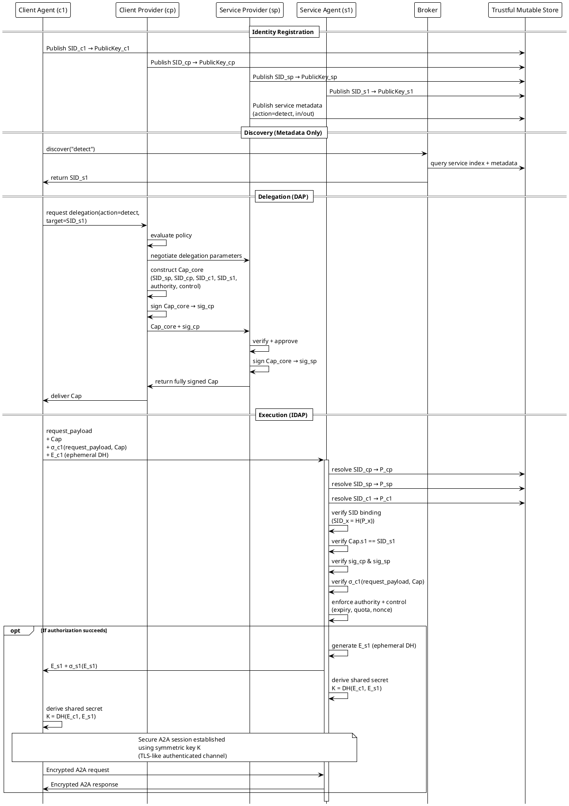

```plantuml

@startuml "SID–DAP–IDAP with Secure A2A Session"
!theme plain
hide footbox
skinparam actorStyle awesome
skinparam maxMessageSize 220
!pragma teoz true

participant "Client Agent (c1)" as c1
participant "Client Provider (cp)" as cp
participant "Service Provider (sp)" as sp
participant "Service Agent (s1)" as s1
participant "Broker" as broker
participant "Trustful Mutable Store" as store

== Identity Registration ==

c1 -> store: Publish SID_c1 → PublicKey_c1
cp -> store: Publish SID_cp → PublicKey_cp
sp -> store: Publish SID_sp → PublicKey_sp
s1 -> store: Publish SID_s1 → PublicKey_s1
sp -> store: Publish service metadata\n(action=detect, in/out)

== Discovery (Metadata Only) ==

c1 -> broker: discover("detect")
broker -> store: query service index + metadata
broker -> c1: return SID_s1

== Delegation (DAP) ==

c1 -> cp: request delegation(action=detect, target=SID_s1)

cp -> cp: evaluate policy
cp -> sp: negotiate delegation parameters

cp -> cp: construct Cap_core\n(SID_sp, SID_cp, SID_c1, SID_s1,\nauthority, control)

cp -> cp: sign Cap_core → sig_cp
cp -> sp: Cap_core + sig_cp

sp -> sp: verify + approve
sp -> sp: sign Cap_core → sig_sp

sp -> cp: return fully signed Cap
cp -> c1: deliver Cap

== Execution (IDAP) ==

c1 -> s1: request_payload\n+ Cap\n+ σ_c1(request_payload, Cap)\n+ E_c1 (ephemeral DH)

activate s1

s1 -> store: resolve SID_cp → P_cp
s1 -> store: resolve SID_sp → P_sp
s1 -> store: resolve SID_c1 → P_c1

s1 -> s1: verify SID binding\n(SID_x = H(P_x))
s1 -> s1: verify Cap.s1 == SID_s1
s1 -> s1: verify sig_cp & sig_sp
s1 -> s1: verify σ_c1(request_payload, Cap)
s1 -> s1: enforce authority + control\n(expiry, quota, nonce)

opt If authorization succeeds
    s1 -> s1: generate E_s1 (ephemeral DH)
    s1 -> c1: E_s1 + σ_s1(E_s1)

    s1 -> s1: derive shared secret\nK = DH(E_c1, E_s1)
    c1 -> c1: derive shared secret\nK = DH(E_c1, E_s1)

    note over c1, s1
    Secure A2A session established
    using symmetric key K
    (TLS-like authenticated channel)
    end note

    c1 -> s1: Encrypted A2A request
    s1 -> c1: Encrypted A2A response
end

deactivate s1

@enduml

@enduml
```