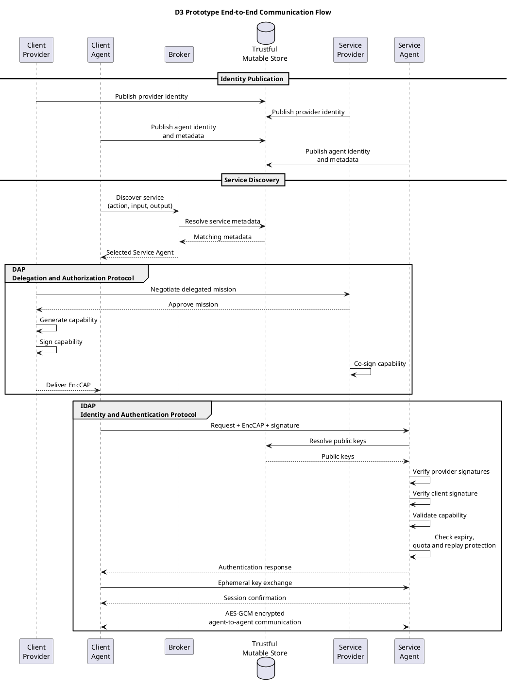

```plantuml
@startuml
title D3 Prototype End-to-End Communication Flow

skinparam ParticipantPadding 20
skinparam BoxPadding 10
skinparam SequenceMessageAlign center
skinparam ResponseMessageBelowArrow true

participant "Client\nProvider" as CP
participant "Client\nAgent" as CA
participant Broker
database "Trustful\nMutable Store" as TMS
participant "Service\nProvider" as SP
participant "Service\nAgent" as SA

== Identity Publication ==

CP -> TMS : Publish provider identity
SP -> TMS : Publish provider identity
CA -> TMS : Publish agent identity\nand metadata
SA -> TMS : Publish agent identity\nand metadata

== Service Discovery ==

CA -> Broker : Discover service\n(action, input, output)
Broker -> TMS : Resolve service metadata
TMS --> Broker : Matching metadata
Broker --> CA : Selected Service Agent

group DAP\nDelegation and Authorization Protocol

CP -> SP : Negotiate delegated mission
SP --> CP : Approve mission

CP -> CP : Generate capability
CP -> CP : Sign capability
SP -> SP : Co-sign capability

CP --> CA : Deliver EncCAP

end

group IDAP\nIdentity and Authentication Protocol

CA -> SA : Request + EncCAP + signature

SA -> TMS : Resolve public keys
TMS --> SA : Public keys

SA -> SA : Verify provider signatures
SA -> SA : Verify client signature
SA -> SA : Validate capability
SA -> SA : Check expiry,\nquota and replay protection

SA --> CA : Authentication response

CA -> SA : Ephemeral key exchange
SA --> CA : Session confirmation

CA <-> SA : AES-GCM encrypted\nagent-to-agent communication

end

@enduml
```